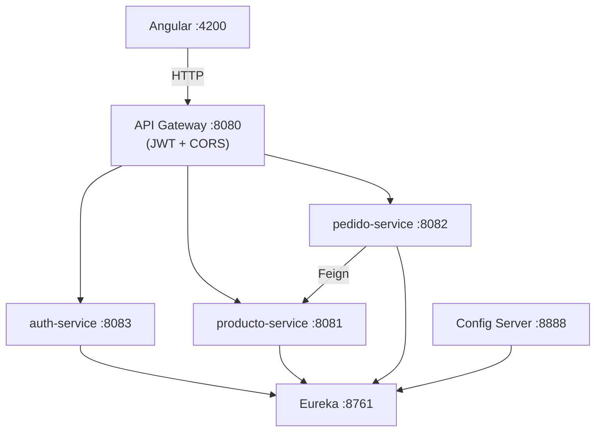

# Comandas de Restaurantes

**Proyecto:** Comandas de Restaurantes (Luis Alberto Arias Ledesma — Cibertec DSW2)  
**Implementación técnica:** demo Spring Cloud ampliado con el MVP de comandas.

Documentación completa: [`docs/00-Indice-Documentacion.md`](docs/00-Indice-Documentacion.md)

## Stack

- Java 17 | Spring Boot 3.5.14 | Spring Cloud 2025.0.2
- Maven (cada módulo es un proyecto Spring Boot independiente)
- Angular 19 (frontend)
- OpenAPI 3 / Swagger UI (springdoc 2.8.5)

## Arquitectura



## Módulos y puertos

| Carpeta                | `spring.application.name` | Puerto | Swagger UI         |
| ---------------------- | ------------------------- | ------ | ------------------ |
| `01-eureka-server`     | eureka-server             | 8761   | —                  |
| `02-config-server`     | config-server             | 8888   | —                  |
| `03-producto-service`  | producto-service          | 8081   | `/swagger-ui.html` |
| `04-pedido-service`    | pedido-service            | 8082   | `/swagger-ui.html` |
| `06-auth-service`      | auth-service              | 8083   | `/swagger-ui.html` |
| `05-api-gateway`       | api-gateway               | 8080   | `/swagger-ui.html` |
| `07-frontend-comandas` | (Angular)                 | 4200   | —                  |

## Base de datos MySQL

El proyecto usa MySQL local para los microservicios con persistencia.

| Servicio              | Base de datos       | Usuario | Password |
| --------------------- | ------------------- | ------- | -------- |
| `06-auth-service`     | `comandas_auth`     | `root`  | `mysql`  |
| `03-producto-service` | `comandas_producto` | `root`  | `mysql`  |
| `04-pedido-service`   | `comandas_pedido`   | `root`  | `mysql`  |

Script de inicialización:

```bash
mysql -u root -pmysql < db/init-comandas-mysql.sql
```

También puede ejecutarse desde MySQL Workbench abriendo `db/init-comandas-mysql.sql`.  
Las tablas y datos demo se crean al iniciar los servicios mediante JPA (`ddl-auto=update`) y los `DataLoader`.

## Orden de arranque (obligatorio)

```bash
# 1. Service Discovery
cd 01-eureka-server && mvn spring-boot:run

# 2. Configuración centralizada
cd 02-config-server && mvn spring-boot:run

# 3. Microservicios de dominio
cd 06-auth-service && mvn spring-boot:run
cd 03-producto-service && mvn spring-boot:run
cd 04-pedido-service && mvn spring-boot:run

# 4. Gateway (último backend)
cd 05-api-gateway && mvn spring-boot:run

# 5. Frontend
cd 07-frontend-comandas && npm start
```

Esperar a que Eureka muestre cada servicio como **UP** antes de arrancar el siguiente.

## Cómo ejecutar cada microservicio

Cada módulo es independiente. Desde la raíz del módulo:

```bash
mvn spring-boot:run
```

Alternativa con JAR:

```bash
mvn -q package -DskipTests
java -jar target/<artifactId>-1.0.0.jar
```

## Pruebas vía Gateway

```bash
# Login
curl -X POST http://localhost:8080/api/auth/login \
  -H "Content-Type: application/json" \
  -d "{\"username\":\"admin\",\"password\":\"admin123\"}"

# Con token
curl http://localhost:8080/api/productos -H "Authorization: Bearer <TOKEN>"
curl http://localhost:8080/api/mesas -H "Authorization: Bearer <TOKEN>"

# Público (sin token)
curl http://localhost:8080/api/publico/local
curl "http://localhost:8080/api/pedidos/simular/1?cantidad=2"
```

## Colección Postman

Importar: [`docs/postman/Comandas-API.postman_collection.json`](docs/postman/Comandas-API.postman_collection.json)

Variable `baseUrl`: `http://localhost:8080/api`. El request **Login** guarda el JWT en `token`.

## Usuarios demo

| Usuario | Password  | Rol      |
| ------- | --------- | -------- |
| admin   | admin123  | ADMIN    |
| mozo1   | mozo123   | MOZO     |
| cocina1 | cocina123 | COCINERO |

## Frontend Angular

```bash
cd 07-frontend-comandas
npm install
npm start
```

UI en [http://localhost:4200](http://localhost:4200) — rutas: `/login`, `/admin`, `/mozo`, `/cocina`, `/qr`.

## Estructura de paquetes (microservicios)

```
com.cibertec.<servicio>/
├── controller/     REST endpoints
├── service/        Lógica de negocio
├── repository/     JPA
├── entity/         Modelo persistente
├── dto/            Request/Response
├── client/         Feign (pedido -> producto)
├── config/         Security, OpenAPI, DataLoader
└── exception/      GlobalExceptionHandler + ApiErrorResponse
```

## Formato de error estándar

```json
{
  "timestamp": "2026-06-23T12:00:00Z",
  "status": 404,
  "error": "Not Found",
  "message": "Producto no encontrado",
  "path": "/productos/99"
}
```

## Despliegue VPS (OVH)

```bash
./scripts/setup-vps-production.sh   # primera vez: Java, nginx, systemd
./scripts/setup-mysql-vps.sh        # primera vez: MySQL + /etc/comandas/comandas.env
./scripts/deploy-vps.sh             # compilar y publicar
```

Cada `git push` a `main` puede relanzar el deploy si `VPS_DEPLOY_ENABLED=true` en GitHub Actions.

Ver [`docs/Despliegue-GitHub-VPS.md`](docs/Despliegue-GitHub-VPS.md) y [`db/README.md`](db/README.md).
