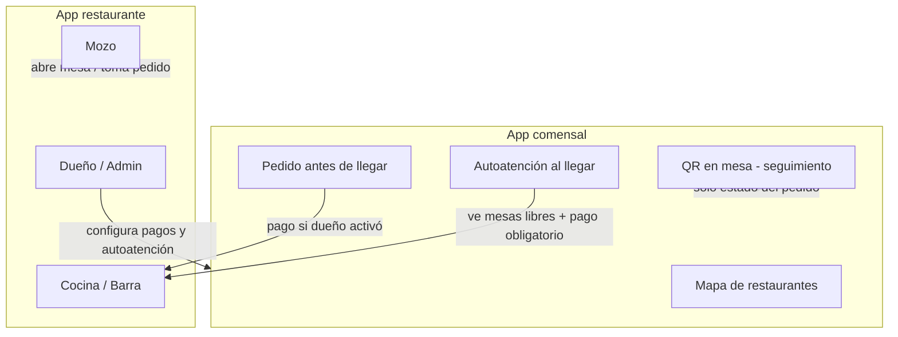
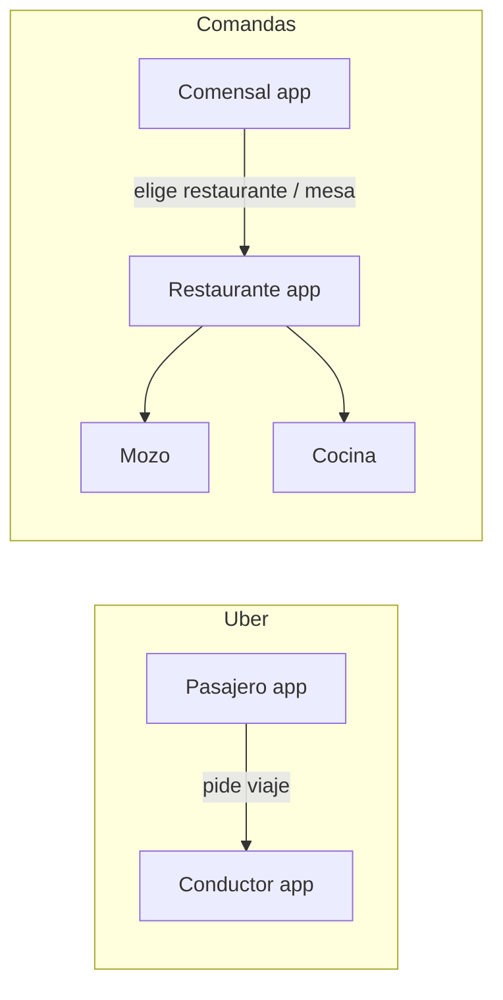

# Sistema de Comandas Digital para Restaurante
## Documento de emprendimiento tecnológico

**Proyecto:** Comandas Restaurante  
**Versión del documento:** 1.0 (borrador)  
**Autor:** Luis Alberto Arias Ledesma  
**Fecha:** 4 de junio de 2026  
**Curso / institución:** Desarrollo de Servicios Web 2 — Cibertec

---

# 1. Ficha de la idea

## 1.1 Nombre del proyecto
**Comandas de Restaurantes** — Sistema digital de gestión de pedidos para locales gastronómicos.

## 1.2 Problema que se resuelve
En muchos restaurantes de menú en Lima, la operación entre salón y cocina sigue apoyada en **procesos manuales**: apuntes en papel, órdenes verbales y comunicación informal entre mozo y cocinero. Esta forma de trabajo genera **pérdida de información**, pedidos incompletos o difíciles de leer, demoras en la transmisión del pedido y **errores** que afectan tiempos de atención y satisfacción del comensal. La información no queda registrada de manera centralizada ni en tiempo real, lo que dificulta coordinar varias mesas y varias rondas de pedido en horarios de alta demanda.

## 1.3 Público objetivo
- **Cliente del negocio:** restaurantes de menú en Lima — **plan gratis** (hasta 15 mesas); **plan premium** (locales medianos 16–30+ mesas y personalización de marca).  
- **Usuarios operativos diarios:** mozos (toma de pedidos en salón), cocineros (preparación según comanda digital) y, como valor agregado, **comensales** que visualizan el estado de su pedido.  
- **Usuario administrador (futuro):** dueño o encargado del local (gestión de menú, mesas y reportes básicos).

## 1.4 Solución propuesta
Plataforma de comandas digitales integrada al flujo del restaurante: el **mozo** registra el pedido por **mesa y silla** desde un **celular o tablet**; la información llega al **cocinero** en otro **móvil o tablet** (sin exigir equipos caros). El cocinero marca avances; el mozo recibe avisos según el modo configurado (comanda completa o por ítem). El **comensal** consulta el estado en **su propio smartphone** escaneando un **código QR en la mesa** (sin que el local deba comprar una TV). Opcionalmente, restaurantes con mayor inversión pueden usar una **TV dedicada** con la misma información. Varios pedidos por mesa en tandas; el mozo atiende múltiples mesas en paralelo.

## 1.5 Propuesta de valor
- **Para el restaurante:** menos errores de comunicación, pedidos legibles, trazabilidad del pedido y mejor coordinación en hora punta.  
- **Para mozo y cocina:** flujo claro, sin depender solo de papel o memoria verbal.  
- **Para el comensal:** seguimiento en su móvil (casi todos traen celular); sin depender de TV del local.
- **Para el dueño con poco presupuesto:** solo necesita móviles/tablets para personal, no pantallas extra.

## 1.6 Diferenciación respecto a alternativas
Frente al **papel y la comunicación verbal**, el sistema ofrece registro digital estructurado por **mesa y silla**, envío inmediato a cocina y estados del pedido (pendiente, en preparación, listo). Frente a soluciones genéricas o solo POS de caja, el foco está en el **flujo operativo mozo–cocina–cliente** y en la **pantalla pública de seguimiento** para el comensal, adaptado a restaurantes de menú con servicio en mesa.

## 1.7 Modelo de ingresos — Plan GRATIS vs Plan PREMIUM

### Plan GRATIS (funcional básico — debe sentirse “completo” para el día a día)

Orientado a locales de hasta **15 mesas** o a probar el sistema. **No es una demo vacía:** reemplaza papel y voz con el flujo real mozo–cocina–cliente.

| Beneficio concreto para el dueño (gratis) | Detalle |
|-------------------------------------------|---------|
| **Adiós al papel en salón y cocina** | Pedidos digitales legibles, por mesa y silla |
| **Cocina y barra coordinadas** | Ítems a COCINA o BARRA; estados en tiempo real |
| **Mozo atiende varias mesas** | Sin límite de comandas; notificaciones según modo A o B |
| **Cliente ve su pedido en el celular** | QR en mesa — sin comprar TV |
| **Hasta 15 mesas** | Cubre la mayoría de cafeterías, pollerías y menús pequeños en Lima |
| **Nombre del local (texto)** | Puede mostrarse el nombre del restaurante (ej. en QR y cabeceras) |
| **Usuarios ilimitados razonables** | Varios mozos y cocineros (ej. hasta 5 mozos + 3 cocina/barra) |
| **Historial del día** | Listado de comandas del turno (sin reportes financieros avanzados) |

| Lo que NO lleva gratis (motivo para pagar premium) | Por qué es premium |
|-----------------------------------------------------|-------------------|
| **Mesa 16 en adelante** | El local creció; necesita escalar |
| **Logo + colores + tema / diseño** | Marca propia; que no parezca “app genérica” |
| **Quitar marca de la plataforma** en pantallas (opcional premium) | Imagen profesional |
| **Dashboard ingresos/gastos, inventario** | Gestión de negocio, no solo comandas |
| **TV modo sala, reportes mensuales, soporte prioritario** | Operación y análisis avanzados |

Si el local necesita **más de 15 mesas** o **verse como su marca**, contrata plan de pago.

> **Mensaje comercial gratis:** *“Opera tu restaurante hasta 15 mesas sin papel; tus clientes siguen el pedido desde el celular. Cero inversión en hardware.”*

### Plan PREMIUM (suscripción mensual — hipótesis)
| Incluye |
|---------|
| **Más de 15 mesas** (16 en adelante; paquetes por volumen: ej. 30, 50 mesas) |
| **Personalización de marca:** nombre comercial del restaurante visible en mozo, cocina, QR y TV |
| **Logo**, **colores**, **diseño** (tema) configurable por el admin |
| Módulos avanzados (fase 2): dashboard ingresos/gastos, inventario, reportes |
| Soporte prioritario y opciones extra (TV, destacado en mapa — según plan) |

*(Precios en soles: por definir tras piloto.)*

### Otros ingresos (fase 3 — app comensal)
- **Publicidad** en la app del comensal.
- **Comisión** por pedidos con pago anticipado (si el restaurante activa pagos).
- Restaurante **destacado** en mapa (plan premium / publicidad).

## 1.8 Visión de producto (plataforma multi-restaurante — lado restaurante)

Plataforma **SaaS** donde cada restaurante tiene panel **administrador / dueño** con login propio.

- **Plan gratis:** operación **completa para el servicio diario** (hasta 15 mesas, QR, cocina/barra, modos A/B); nombre en texto sí; **sin** logo/colores/diseño corporativo.
- **Plan premium:** **escala** (16+ mesas) + **marca visual** (logo, colores, tema) + gestión (dashboard, inventario).

## 1.9 App del comensal (marketplace — “como Uber, pero restaurantes”)

Además del **QR en mesa** (cliente ya sentado), existirá una **aplicación móvil para comensales** (fase 3), gratuita para quien come.

### Analogía
| Uber | Comandas de Restaurantes |
|------|--------------------------|
| Pasajero abre su app | Comensal abre **app comensal** |
| Ve conductores / opciones cercanas | Ve **restaurantes registrados** en mapa o lista |
| Elige un viaje | Elige **restaurante** y arma pedido del menú |
| Paga desde la app | **Puede pagar antes de ir** — solo si el restaurante lo activó |
| El conductor recibe la solicitud | El restaurante recibe pedido en cocina (como comanda anticipada) |

### Tres formas de pedir (comensal) — no confundir

| # | Escenario | Qué usa el comensal | Pago | Fase |
|---|-----------|---------------------|------|------|
| **A** | Ya está sentado; el mozo tomó el pedido | **QR en mesa** → solo **seguimiento** del pedido | En el local (mozo/caja) | MVP |
| **B** | **Aún no llegó**; quiere comida lista al llegar | **App comensal** → mapa, elige restaurante, pedido anticipado | Anticipado en app **si el dueño activó pagos** | Fase 3 |
| **C** | **Acaba de llegar** al local; quiere **autoatenderse** | **App comensal** → ve **mesas libres en tiempo real**, elige mesa/silla, pide desde el menú | **Obligatorio pagar en app** para que el pedido entre a cocina (autoatención) | Fase 3 |

### Flujo B — Pedido antes de llegar (anticipado)
1. Ve restaurantes en mapa con precios de referencia.
2. Arma pedido e indica hora estimada de llegada.
3. Si el dueño activó **pagos en app**, paga antes de ir → cocina prepara con anticipación.
4. Notificaciones: en preparación / listo.

### Flujo C — Autoatención al llegar (nuevo)
Para clientes que **prefieren no esperar al mozo** o el local quiere reducir carga en salón:

1. El comensal **llega** o está en la puerta del restaurante y abre la **app comensal**.
2. Entra al perfil del local (debe estar **registrado** en la plataforma).
3. Ve un **mapa o lista de mesas en tiempo real**: **libre** / **ocupada** / **reservada** (actualizado cuando el mozo abre/cierra mesa o hay pedido activo).
4. Selecciona una **mesa disponible** y **silla** (si aplica).
5. Arma su pedido desde el **menú digital** (misma carta que usa el mozo).
6. **Debe pagar en la app** para confirmar el pedido en modo **autoatención** — sin pago, el pedido no se envía a cocina (regla anti-fraude y compromiso del cliente).
7. Tras el pago, la comanda entra a **cocina/barra** con origen `APP_AUTOATENCION`; la mesa pasa a **ocupada** en tiempo real para otros comensales.
8. Sigue el pedido en la app (estados) hasta que el mozo lleva a la mesa o el local define “retira en barra”.

**Beneficio restaurante:** menos idas y vueltas del mozo para tomar pedido inicial; mesas visibles en tiempo real.  
**Beneficio comensal:** elige mesa libre, pide y paga sin esperar — experiencia moderna.

### Qué configura el dueño del restaurante
| Configuración | Descripción |
|---------------|-------------|
| **Visible en app comensal** | Sí/No — aparece en el mapa marketplace |
| **Pagos en app (pedido anticipado)** | Sí/No — cobro antes de llegar (flujo B) |
| **Autoatención al llegar** | Sí/No — permite flujo C (mesas en vivo + pedido por el cliente) |
| **Pago obligatorio en autoatención** | Siempre **Sí** cuando autoatención está activa — el pedido solo se libera a cocina tras pago confirmado |
| **Mostrar mesas en tiempo real** | Sí/No — mapa de disponibilidad para comensales (requiere mesas digitalizadas en el sistema) |
| **Tiempo mínimo de anticipación** | Ej. 20 min (solo flujo B) |
| **Menú y precios** | Sincronizados con comandas del mozo |

### Reglas de mesas en tiempo real
- Estado de mesa: **LIBRE**, **OCUPADA** (sesión abierta o pedido activo), **RESERVADA** (futuro).
- Al pagar autoatención, la mesa seleccionada se **bloquea** para otros usuarios de la app (evita doble selección).
- El **mozo** puede seguir abriendo mesas manualmente; la app refleja el cambio en segundos (WebSocket / SSE).
- Si el comensal abandona sin pagar, la mesa no se bloquea.

### Ingresos para la plataforma (app comensal)
- Publicidad dentro de la app.
- **Comisión** por transacciones (pedido anticipado y autoatención pagada).
- Restaurantes **destacados** en mapa (premium).
- Posible tarifa al restaurante por módulo **autoatención** activo (fase comercial).

## 1.10 Diagrama — Ecosistema de apps

## 1.11 Anexo — Comparativa: Uber vs Comandas de Restaurantes

*Página recomendada para el informe Word: título “Comparación con modelo marketplace (Uber)”.*

### 1.11.1 Idea central

**Uber** conecta **pasajeros** con **conductores** mediante una app del pasajero y otra del conductor, más un panel de la empresa.  
**Comandas de Restaurantes** conecta **comensales** con **restaurantes** (y su personal: mozo, cocina) mediante **app comensal** y **app/panel restaurante**, más administración de la plataforma.

No es copia de Uber: el “viaje” es el **pedido de comida**; el “destino” puede ser **comer en el local**, **llevar listo al llegar** o **autoatenderse en una mesa libre**.

### 1.11.2 Tabla comparativa Uber ↔ Comandas

| Aspecto | Uber (pasajeros / conductores) | Comandas de Restaurantes |
|---------|--------------------------------|---------------------------|
| **App del cliente final** | Uber (pasajero) | **App comensal** (fase 3) |
| **App del proveedor de servicio** | Uber Driver | **App restaurante** (mozo, cocina, admin) |
| **Qué elige el cliente en el mapa** | Conductores / tipo de viaje cercano | **Restaurantes registrados** cercanos con precios de referencia |
| **Reserva / solicitud** | Pide viaje A → B | Pide comida: anticipada, al llegar (autoatención) o en mesa (mozo/QR) |
| **Pago en app** | Sí, habitual | **Opcional** (anticipado) si el dueño activa; **obligatorio** en modo autoatención al llegar |
| **Estado en tiempo real** | “Conductor en camino”, “Ha llegado” | “En preparación”, “Listo”; **mesas libres/ocupadas** en vivo (autoatención) |
| **Quién ejecuta el servicio** | Conductor | Cocina, barra, mozo del restaurante |
| **Modelo de ingreso plataforma** | Comisión por viaje | Comisión por pedido pagado, publicidad, planes premium restaurante |
| **Registro del proveedor** | Conductor se registra en Uber | **Dueño registra su restaurante**; admin crea mozos/cocineros |
| **Personalización marca** | Uber marca fuerte | Restaurante **premium**: logo y colores; gratis: interfaz estándar |
| **Versión gratuita proveedor** | No aplica igual | Restaurante: hasta **15 mesas** gratis operación comandas |

### 1.11.3 Tres flujos del comensal vs “un solo viaje” en Uber

| Flujo Comandas | Equivalente aproximado en Uber | Diferencia clave |
|----------------|-------------------------------|------------------|
| **A – QR en mesa** | Ver en app dónde va tu viaje ya iniciado | No pide viaje; solo **sigue** pedido que tomó el mozo |
| **B – Pedido antes de llegar** | Reservar / programar viaje con hora | Pide comida **antes**; cocina prepara; pago si dueño activa |
| **C – Autoatención al llegar** | Elegir vehículo disponible y confirmar | Elige **mesa libre en vivo**, pide y **paga**; no hay “conductor”, hay **mesa + cocina** |

### 1.11.4 Comparativa con delivery (Rappi, PedidosYa) — diferenciación

| Aspecto | Apps delivery (referencia Perú) | Comandas de Restaurantes |
|---------|--------------------------------|---------------------------|
| **Foco principal** | Llevar comida a domicilio | **Servicio en el restaurante** (salón, mesa, cocina) |
| **Personal del local** | A veces secundario | **Mozo y cocina** en el centro (comandas digitales) |
| **Cliente en el local** | Poco enfocado | **QR, autoatención, mesas en tiempo real** |
| **Costo entrada restaurante** | Comisiones altas, listing | **Plan gratis** hasta 15 mesas |
| **Mapa de restaurantes** | Sí (delivery) | Sí (fase 3): ver locales, precios, pedir antes o al llegar |

*Nota: Rappi/PedidosYa son referencia de mercado; no sustituyen la operación interna mozo–cocina que resuelve este proyecto.*

### 1.11.5 Mensaje de elevator pitch (para presentación oral)

> “Somos el **Uber de elegir dónde comer y cómo pedir**, pero dentro del restaurante: el comensal ve locales en el mapa, puede pedir antes de llegar o **autoatenderse** viendo **mesas libres en tiempo real** y pagando desde el celular; el restaurante, sin papel, recibe todo en cocina. El dueño activa lo que quiera: solo comandas, pagos o autoatención.”

### 1.11.6 Diagrama comparativo roles

---

# 2. Business Model Canvas

| Bloque | Contenido |
|--------|-----------|
| **Segmentos de clientes** | Restaurantes pequeños (hasta 15 mesas, plan gratis); medianos (16–30+ mesas, plan premium); comensales en app futura. |
| **Propuesta de valor** | **Restaurante:** comandas sin papel; opción autoatención. **Comensal:** mapa de locales, pedido anticipado, **mesas libres en vivo**, pedido y pago al llegar sin mozo (si el dueño lo activa). |
| **Canales** | **Venta y contacto presencial** con dueños de restaurante; recomendación por **conocidos** y boca a boca; demo en dispositivo; futuro: web, redes y app comensal como canal de descubrimiento. |
| **Relación con clientes** | Capacitación inicial al personal; soporte en implementación; onboarding del admin (mesas, usuarios, branding); actualizaciones según plan contratado. |
| **Fuentes de ingreso** | Suscripción **premium** (mesas >15, branding, dashboard, inventario); publicidad en app comensal; destacado en mapa. |
| **Recursos clave** | Software multi-tenant; VPS y dominio; equipo de desarrollo (autor); relaciones con primer restaurante piloto. |
| **Actividades clave** | Desarrollo y despliegue; visitas presenciales de venta/demo; soporte y mejora continua; moderación de restaurantes en mapa. |
| **Socios clave** | Proveedor hosting (OVH/VPS); futuros pasarelas de pago; posibles aliados de publicidad. |
| **Estructura de costos** | **VPS**, **dominio**, **tiempo de desarrollo** (costo de oportunidad); marketing inicial bajo (canal presencial y conocidos); escalado de infra al crecer usuarios. |

---

# 3. Alcance del MVP (primera versión)

## 3.1 Fase MVP — Piloto en 1 restaurante (prioridad alta)

**Implementar lógica de planes desde el inicio:**

### Plan GRATIS (MVP obligatorio)
- [x] Login **administrador / dueño**
- [x] Configuración **básica:** hasta **15 mesas**, sillas, menú, usuarios mozo/cocinero/barra
- [x] **Nombre del local en texto** (visible en QR y pantallas) — sí en gratis
- [x] **Sin** logo, colores ni tema personalizado — interfaz estándar (premium desbloquea branding)
- [x] Móvil: mozo toma pedidos de **varias mesas** con **silla** por comensal
- [x] Envío de comanda a cocina; notificación al mozo cuando cocina marca avance
- [x] Tablet cocina: cola de comandas; cocinero marca ítems en preparación
- [x] **Modo de servicio configurable** por el administrador (ver RN-03 y RN-07): opción A *comanda completa* u opción B *por ítem listo*
- [x] **Móvil como canal principal** (mozo y cocinero); no se exige TV para operar el MVP
- [x] **Seguimiento para el comensal sin TV:** enlace o código QR en mesa → el cliente ve el estado del pedido en **su propio celular** (sin instalar app en fase MVP; página web)
- [ ] TV en salón **opcional** (local con más inversión): pantalla dedicada con la misma información que ve el comensal en móvil

### Plan PREMIUM (MVP: validar cobro; puede activarse manual al inicio)
- [ ] Registro de plan activo por restaurante (`FREE` | `PREMIUM`)
- [ ] Bloqueo al crear mesa **16+** si plan es FREE (mensaje: actualizar a premium)
- [ ] Módulo **branding:** nombre comercial, logo, colores primario/secundario, diseño/tema en mozo, cocina y QR
- [ ] Dashboard ingresos / gastos e inventario (fase 2 comercial)

## 3.2 Fase 2 — Escala comercial
- [ ] Varios restaurantes en la misma plataforma
- [ ] Pasarela de pago / facturación de suscripción premium
- [ ] Reportes avanzados y soporte

## 3.3 Fase 3 — App comensal (marketplace + autoatención)
- [ ] App móvil comensal (Android/iOS o PWA): registro del usuario final
- [ ] Mapa de **restaurantes registrados**; precios de referencia
- [ ] **Flujo B:** pedido anticipado + pago opcional (si dueño activa pagos)
- [ ] **Flujo C — Autoatención al llegar:**
  - [ ] Vista **mesas en tiempo real** (libre / ocupada)
  - [ ] Selección de mesa y silla disponible
  - [ ] Pedido desde menú por el comensal
  - [ ] **Pago obligatorio** para enviar comanda a cocina
  - [ ] Bloqueo de mesa tras pago confirmado
- [ ] Sincronización en vivo con panel mozo/admin (WebSocket)
- [ ] Orígenes de comanda: `MOZO`, `APP_ANTICIPADO`, `APP_AUTOATENCION`
- [ ] Publicidad, comisión por transacción, locales destacados

## 3.4 No incluye (explícito en corto plazo)
- Facturación electrónica SUNAT
- Delivery / multi-sucursal corporativa
- Investigación formal de competencia (pendiente)

## 3.5 Justificación del alcance por fases
El **MVP en un restaurante real** valida operación mozo–cocina–TV sin construir de inmediato mapa nacional ni publicidad. La arquitectura se diseña **multi-restaurante** desde el admin, pero el piloto reduce riesgo técnico y de adopción. Las fases 2 y 3 financian el modelo freemium + premium + app comensal.

---

# 4. Actores del sistema

| Actor | Rol | Login en MVP |
|-------|-----|--------------|
| **Administrador / dueño** | **Gratis:** hasta 15 mesas, menú, usuarios, modo servicio A/B. **Premium:** más mesas + nombre comercial, logo, colores y diseño | **Sí** |
| **Mozo** | Atiende varias mesas; registra pedidos por silla; recibe notificaciones de cocina (comanda lista para servir); puede interrumpir flujo actual al llegar aviso prioritario | **Sí** (credenciales del admin) |
| **Cocinero** | Ve ítems de estación COCINA; marca preparación y listo | **Sí** (credenciales del admin) |
| **Barra** | Ve ítems de estación BARRA (bebidas); mismas reglas de estado que cocina | **Sí** (rol opcional o mismo usuario cocina en locales pequeños) |
| **Cliente comensal (en local)** | Ve estado del pedido en **su móvil** (QR/enlace en mesa); opcionalmente en **TV** del local si el restaurante la tiene | **No** (solo abre enlace; sin cuenta en MVP) |
| **Comensal (app marketplace)** | Mapa de locales; pedido anticipado (pago si dueño activa); **al llegar:** ve mesas libres en tiempo real, autoatiende pedido y **paga en app** para enviar a cocina | **Sí** (fase 3) |
| **Super admin plataforma** (futuro) | Gestiona restaurantes registrados en el SaaS | Fase 2+ |

---

# 5. Requisitos funcionales (RF)

| ID | Requisito | Prioridad (Alta/Media/Baja) |
|----|-----------|----------------------------|
| RF-01 | El administrador en plan **GRATIS** debe configurar hasta **15 mesas**, sillas y menú (sin logo ni colores personalizados) | Alta |
| RF-01b | El sistema debe **impedir registrar la mesa 16** en plan gratis y ofrecer upgrade a premium | Alta |
| RF-01c | En plan **PREMIUM** el administrador debe configurar nombre comercial, logo, colores y diseño del local | Alta |
| RF-02 | El administrador debe crear y desactivar usuarios mozo y cocinero con credenciales | Alta |
| RF-03 | El mozo debe registrar pedidos de múltiples mesas, cada línea asociada a mesa y silla | Alta |
| RF-04 | El mozo debe enviar comandas a cocina y continuar con otras mesas | Alta |
| RF-05 | El cocinero debe visualizar cola de comandas e ítems por mesa/silla | Alta |
| RF-06 | El cocinero debe marcar ítems en preparación y completar comanda | Alta |
| RF-07 | El sistema debe notificar al mozo según el **modo de servicio** configurado: (A) comanda completa o (B) por cada ítem listo | Alta |
| RF-07b | El administrador debe poder seleccionar el modo de servicio (A o B) en la configuración del local | Alta |
| RF-08 | El comensal debe poder ver el estado del pedido en **su móvil** (web por QR o enlace en mesa), sin costo de hardware extra para el restaurante | Alta |
| RF-08b | Opcional: la misma vista en **TV dedicada** del local para quienes invierten en pantalla en salón | Media |
| RF-09 | El comensal en fase 3 podrá ver mapa de restaurantes registrados con precios (app gratuita) | Baja |
| RF-10 | Módulos premium: dashboard financiero e inventario (fase 2, de pago) | Media |
| RF-11 | Cada producto debe indicar estación de preparación (COCINA o BARRA) y enrutarse a la cola correcta | Alta |
| RF-12 | El administrador debe definir capacidad de sillas por mesa (promedio 4, máximo 8) | Media |
| RF-13 | El comensal en la app debe ver restaurantes registrados cercanos con menú y precios de referencia | Baja (fase 3) |
| RF-14 | El comensal debe poder crear pedido anticipado con hora estimada de llegada | Baja (fase 3) |
| RF-15 | El administrador del restaurante debe activar o desactivar **pagos en app**; si está desactivado, no se muestra cobro en línea | Baja (fase 3) |
| RF-16 | Si pagos están activos, el comensal debe poder pagar antes de llegar y el pedido debe ingresar a cocina como comanda prioritaria según reglas del local | Baja (fase 3) |
| RF-17 | Si el dueño activa **autoatención**, el comensal debe ver **disponibilidad de mesas en tiempo real** del restaurante seleccionado | Baja (fase 3) |
| RF-18 | En autoatención, el comensal debe elegir mesa libre y silla, armar pedido desde el menú y **pagar en app** para que la comanda se envíe a cocina | Baja (fase 3) |
| RF-19 | Tras pago en autoatención, la mesa debe marcarse **ocupada** en tiempo real para otros usuarios de la app | Baja (fase 3) |
| RF-20 | El mozo y el admin deben ver en su panel pedidos con origen autoatención / anticipado / mozo | Media (fase 3) |

---

# 6. Historias de usuario (HU)

## HU-01 – Configurar el local (plan gratis)
**Como** dueño en plan gratuito **quiero** configurar hasta 15 mesas, sillas y menú **para** operar sin pagar y sin necesitar diseño personalizado.

**Criterios de aceptación:**
1. Puedo crear mesas del 1 al 15.
2. Al intentar la mesa 16 el sistema muestra mensaje de límite y opción premium.
3. Puedo registrar mozos y cocineros con usuario y contraseña.

## HU-01b – Personalizar marca (plan premium)
**Como** dueño premium **quiero** poner nombre del restaurante, logo y colores **para** que la app se vea como mi marca.

**Criterios de aceptación:**
1. El nombre configurado aparece en mozo, cocina y vista QR del comensal.
2. Puedo subir logo y elegir colores del tema.
3. Puedo registrar más de 15 mesas.

## HU-02 – Tomar pedido en varias mesas
**Como** mozo **quiero** registrar pedidos por mesa y silla desde el móvil **para** atender varios clientes sin papel.

**Criterios de aceptación:**
1. Puedo cambiar de mesa sin perder pedidos en borrador.
2. Cada línea queda ligada a mesa y número de silla.

## HU-03 – Recibir aviso de cocina
**Como** mozo **quiero** recibir notificaciones según el modo configurado por el dueño **para** servir en el ritmo que el restaurante necesite.

**Criterios de aceptación:**
1. La notificación se muestra aunque esté tomando pedido en otra mesa.
2. **Modo A:** un aviso cuando todos los ítems de la comanda (mesa/silla) estén listos.
3. **Modo B:** un aviso por cada ítem que el cocinero marque como listo.

## HU-04 – Preparar en cocina
**Como** cocinero **quiero** ver y actualizar el estado de cada ítem **para** coordinar la preparación.

**Criterios de aceptación:**
1. Veo mesa, silla y observaciones del pedido.
2. Puedo marcar ítems y cerrar la comanda como lista para servicio.

## HU-05 – Seguimiento en el móvil del comensal (sin TV obligatoria)
**Como** comensal **quiero** escanear un QR en la mesa y ver en mi celular el estado de mi pedido **para** no depender de que el restaurante compre una TV.

**Criterios de aceptación:**
1. Abro un enlace web sin instalar aplicación (MVP).
2. Veo mesa/silla (o código anónimo), ítems y estados (en preparación / listo / servido).
3. La vista se actualiza en tiempo real.

## HU-06 – Pedir antes de llegar (app comensal — fase 3)
**Como** comensal **quiero** ver restaurantes en un mapa y pedir comida para que esté lista cuando llegue **para** ahorrar tiempo.

**Criterios de aceptación:**
1. Veo locales registrados cercanos con precios de referencia.
2. Armo pedido y opcionalmente indico hora de llegada.
3. Si el local activó pagos, puedo pagar en la app; si no, solo envío pedido y pago en el local.

## HU-07 – Activar pagos y autoatención (dueño — fase 3)
**Como** dueño **quiero** activar pagos anticipados y/o **autoatención al llegar** **para** controlar cómo me pagan y si los clientes piden solos.

**Criterios de aceptación:**
1. Puedo activar/desactivar **pagos en app** (pedido antes de llegar).
2. Puedo activar/desactivar **autoatención** (mesas en vivo + pedido del comensal).
3. En autoatención, el pedido solo va a cocina tras **pago confirmado**.

## HU-08 – Autoatenderse al llegar (comensal — fase 3)
**Como** comensal que acaba de llegar **quiero** ver mesas libres, elegir una, pedir y pagar desde mi celular **para** no esperar al mozo.

**Criterios de aceptación:**
1. Veo mesas **libres/ocupadas** actualizadas en tiempo real.
2. Solo puedo reservar mesa libre; al pagar, mi pedido entra a cocina y la mesa queda ocupada para otros.
3. Recibo notificaciones de estado hasta que el pedido está listo.

## HU-05b – Seguimiento en TV (opcional)
**Como** dueño con inversión en pantalla **quiero** mostrar en TV la misma información **para** visibilidad en salón.

**Criterios de aceptación:**
1. TV en modo pantalla completa (URL del local); no obligatoria para activar el sistema.

---

# 7. Reglas de negocio (RN)

| ID | Regla |
|----|-------|
| RN-01 | Cada línea de pedido pertenece a una mesa y una silla. |
| RN-02 | El mozo puede atender varias mesas; puede enviar varias comandas en tandas. |
| RN-03 | El cocinero siempre marca avance **por ítem** (cada plato/bebida tiene su estado). |
| RN-04 | Las notificaciones al mozo pueden interrumpir la pantalla actual (prioridad operativa cocina–salón). |
| RN-05 | Cada restaurante (tenant) tiene datos y branding aislados; solo su admin gestiona usuarios y configuración. |
| RN-06 | **Plan GRATIS:** máximo **15 mesas**; funcionalidad operativa **completa** (comandas, QR, modos A/B, barra/cocina, historial del día); nombre del local en texto permitido; **sin** logo, colores ni tema personalizado. |
| RN-06b | **Plan PREMIUM:** mesas ilimitadas según paquete contratado; habilita branding y módulos de gestión avanzada. |
| RN-08 | **Hardware mínimo del restaurante:** al menos un **móvil o tablet** para mozo y uno para cocina (pueden ser celulares personales del local con navegador). **TV no es requisito** para usar el sistema. |
| RN-09 | El comensal usa **su propio smartphone** para seguimiento vía QR; cubre locales con baja inversión en equipamiento. |
| RN-10 | Pedidos desde **app comensal** solo aplican a restaurantes **registrados y visibles** en el marketplace. |
| RN-11 | **Pago anticipado** solo está disponible si el dueño activó **pagos en app**; la plataforma no cobra en línea sin consentimiento del local. |
| RN-12 | Pedido anticipado pagado genera comanda en cocina con marca de origen y estado de pago; cocina puede iniciar preparación antes de que el cliente llegue físicamente. |
| RN-13 | **Autoatención:** el comensal solo puede confirmar pedido tras **pago exitoso** en app; la mesa elegida se bloquea para otros comensales. |
| RN-14 | La disponibilidad de mesas se actualiza en **tiempo real** para app comensal y panel del restaurante (misma fuente de verdad). |
| RN-15 | El dueño puede desactivar autoatención y operar solo con mozo; el QR en mesa sigue disponible para seguimiento. |
| RN-07 | **Modo de servicio al mozo** (configurable por el administrador del local): ver tabla siguiente. |

### RN-07 — Dos modos de aviso al mozo (el dueño elige en configuración)

| Modo | Nombre | Cuándo avisa al mozo | Cuándo conviene |
|------|--------|----------------------|------------------|
| **A** | **Comanda completa** | Solo cuando **todos** los ítems de esa comanda (mesa/silla) están listos | Menú ejecutivo, fuentes, mesas donde todos comen “a la vez”; evita que uno coma y el otro espere |
| **B** | **Por ítem listo** | Cada vez que el cocinero marca **un ítem** como listo | Platos que se enfrían rápido, bebidas primero, barra más rápida que cocina, servicio ágil ítem a ítem |

- En ambos modos el comensal ve el detalle por ítem en **su móvil** (y en **TV** si el local la tiene).
- El administrador cambia el modo en panel de configuración; valor por defecto en piloto: **Modo A (comanda completa)**.

---

# 8. Casos de uso (resumen)

| ID | Caso de uso | Actor principal |
|----|-------------|-----------------|
| CU-01 | Tomar pedido en mesa | Mozo |
| CU-02 | Preparar pedido en cocina | Cocinero |
| CU-03 | Gestionar menú | Administrador |
| CU-04 | Configurar restaurante y usuarios | Administrador |
| CU-05 | Ver pedido en móvil (QR) o TV opcional | Comensal |
| CU-06 | Preparar ítems en barra | Bartender / barra |
| CU-07 | Buscar restaurante y pedir anticipado | Comensal (app) |
| CU-08 | Activar pagos, autoatención y visibilidad en marketplace | Administrador / dueño |
| CU-09 | Ver mesas libres y pedir con pago (autoatención) | Comensal (app) |

### CU-01 – Tomar pedido
- **Precondición:** Mozo autenticado; mesa abierta.
- **Flujo principal:** Selecciona mesa y silla → agrega ítems → envía comanda → cocina recibe.
- **Flujo alternativo:** Llega notificación de comanda lista; mozo atiende servicio y retoma otra mesa.

### CU-03 – TV en salón (decisión técnica documentada)
- **Recomendación MVP:** TV o tablet **dedicada** con navegador en pantalla completa (URL del local). No superponer sobre señal de TV abierta (complejidad alta, poco legible).
- **Alternativa futura:** Stick Android TV con app propia a pantalla completa.

---

# 9. Requisitos no funcionales (RNF)

| ID | Requisito |
|----|-----------|
| RNF-01 | Disponibilidad en horario de servicio del restaurante (VPS systemd) |
| RNF-02 | Notificaciones mozo en menos de 5 s tras marcar comanda lista en cocina |
| RNF-03 | Autenticación por rol (admin, mozo, cocinero); datos por restaurante aislados (multi-tenant) |
| RNF-04 | Persistencia en base de datos relacional (PostgreSQL recomendado) |
| RNF-05 | Interfaces responsive: móvil (mozo), tablet (cocina), navegador TV (comensal en local) |

---

# 10. Diseño técnico (fase posterior al negocio)

## 10.1 Stack tecnológico previsto
- Backend: Spring Boot 3.x, Java 17, microservicios (Spring Cloud) — curso DSW / demo VPS existente
- Base de datos: **PostgreSQL** (multi-tenant por `restaurant_id`)
- Despliegue: VPS OVH, systemd, API Gateway :8080
- Frontend: aplicación web responsive (móvil mozo, tablet cocina, vista TV fullscreen)
- Tiempo real: WebSocket o SSE para TV y notificaciones mozo

## 10.2 Servicios (evolución arquitectura)
| Servicio | Responsabilidad |
|----------|-----------------|
| producto-service | Menú por restaurante |
| pedido-service | Mesas, comandas, estados, notificaciones |
| auth-service (futuro) o módulo auth | Admin, mozo, cocinero, JWT |
| api-gateway | Entrada única |
| eureka / config-server | Infraestructura Cloud (curso) |

## 10.3 Entidades principales (datos)
Restaurante (tenant), Usuario (rol), Mesa, Silla, SesiónMesa, Comanda, LineaPedido, Producto, EstadoComanda, ConfiguracionBranding.

## 10.4 Comensal y TV — implementación recomendada
- **MVP (todos los casos):** QR en mesa → URL `https://tudominio/pedido/{tokenMesa}` → vista móvil responsive (estado por ítem).
- **Opcional con inversión:** misma URL en TV a pantalla completa (`/tv/{codigoLocal}` o rotación de pedidos activos).
- **No requisito:** TV ni superposición sobre canal abierto.

---

# 11. Plan de validación del emprendimiento

| Pregunta a validar | Cómo se valida | Métrica |
|--------------------|----------------|---------|
| ¿El mozo lo usa en hora punta? | Piloto 2 semanas en horario almuerzo/cena; encuesta rápida al cierre | ≥ 80 % de pedidos registrados en app vs papel |
| ¿Cocina reduce errores? | Comparar reclamos o pedidos repetidos antes/después (bitácora del dueño) | Reducción percibida o menos órdenes “mal escuchadas” |
| ¿El dueño pagaría por premium? | Ofrecer gratis MVP luego plan con dashboard/inventario | % conversión a plan pago |
| ¿La app comensal genera tráfico? | Registrar 10 locales en mapa | Visitas y clics en mapa |

---

# 12. Riesgos y mitigación

| Riesgo | Impacto | Mitigación |
|--------|---------|------------|
| Alcance muy amplio (mapa, ads, multi-tenant) retrasa MVP | Alto | Priorizar piloto 1 restaurante |
| WiFi inestable en local | Medio | Modo degradado / reintento en móvil |
| Personal no adopta la app | Alto | Capacitación presencial; UI simple |
| Competencia no investigada | Medio | Estudio de mercado Perú (fase documentación) |

---

# 13. Cronograma alto nivel (opcional)

| Fase | Entregable | Estado |
|------|------------|--------|
| Documento de negocio | Este documento | En curso |
| MVP piloto (1 restaurante) | Comandas + admin + TV dedicada | Pendiente |
| Fase 2 multi-restaurante + premium | Dashboard, inventario | Pendiente |
| Fase 3 app comensal | Mapa, precios, publicidad | Pendiente |

---

# 14. Definiciones operativas (Bloque 3 — criterio lógico del proyecto)

## 14.1 Restaurante piloto
- **Estado:** en búsqueda del primer local piloto (aún sin contrato firmado).
- **Perfil objetivo:** restaurante de **menú** en **Lima**, 20–30 mesas, servicio en salón, interés en digitalizar sin gran inversión en hardware.
- **Canal de acercamiento:** visita **presencial**, contacto por **conocidos** o dueños que ya usan solo papel.
- **Duración piloto sugerida:** 2–4 semanas en horarios de mayor demanda (almuerzo y cena).

## 14.2 Barra vs cocina
- **Sí:** bebidas y cócteles sin preparación caliente van a estación **BAR**; platos de cocina van a **COCINA**.
- Cada producto del menú lleva campo `estacion` (COCINA | BARRA).
- Tablet/celular de **barra** solo ve ítems de barra; cocina solo ve ítems de cocina.
- El mozo recibe avisos según el modo A/B **por comanda o por ítem**, sin importar la estación (puede haber ítems listos en barra antes que en cocina; en **Modo A** el aviso de “servir todo” espera a que **todos** los ítems de esa comanda estén listos en ambas estaciones).

## 14.3 Mesas y sillas
- **Límite plan GRATIS:** **15 mesas** por restaurante (regla de negocio principal de monetización).
- **Plan PREMIUM:** más de 15 mesas según paquete contratado.
- **Promedio:** 4 sillas por mesa; **máximo configurable:** 8 sillas por mesa.
- Locales con 20–30 mesas en Lima son **clientes objetivo premium**, no gratis.

## 14.4 Vista del comensal (móvil por QR; TV opcional)
Texto e información mostrada (sin exponer datos sensibles):
- Título: **“Tu pedido – [Nombre del restaurante]”**
- **Mesa X · Silla Y** (o código corto si se prefiere privacidad en pantalla pública)
- Lista de ítems con estado: **En preparación** / **Listo** / **Servido**
- **No mostrar precios** en la vista del comensal por defecto (el dueño puede activarlo en configuración avanzada fase 2).
- **No mostrar** datos personales del mozo ni teléfonos.
- Mensaje cuando todo está listo según modo del local: *“Tu pedido está listo. El mozo lo llevará a tu mesa.”*

## 14.5 Entrega académica (DSW — Desarrollo de Servicios Web 2)
- **Documento de emprendimiento:** este archivo (idea, canvas, MVP, RF, HU, reglas).
- **Implementación técnica (curso):** backend con **Spring Boot 3 + Spring Cloud** (microservicios alineados al demo: Eureka, Config, producto, pedido, Gateway), APIs REST, persistencia en BD, despliegue en **VPS** demostrable.
- **Front:** web responsive (móvil mozo, cocina/barra, vista QR comensal); no es obligatorio app nativa en la primera entrega.
- **Conclusión lógica:** entrega **documento + código + demo funcional** del MVP piloto (no solo Word), salvo que el profesor indique lo contrario en el enunciado — en ese caso prevalece el Word del curso.

## 14.7 App comensal — resumen para Word (marketplace + autoatención)

**Mensaje para el profesor o jurado:**  
La plataforma tiene **dos caras**: (1) **B2B** — operación del restaurante (mozo, cocina, admin); (2) **B2C** — app del comensal (como Uber: el pasajero elige entre opciones en el mapa). El comensal puede: **(B)** pedir antes de llegar y pagar si el dueño lo permite; **(C)** al **llegar**, ver **mesas disponibles en tiempo real**, elegir mesa, armar el pedido y **pagar en la app** para autoatenderse — el pedido solo entra a cocina tras el pago. El dueño activa o desactiva pagos y autoatención por local.

**Flujo B — Anticipado:** mapa → restaurante → menú → hora de llegada → pago (opcional) → cocina.

**Flujo C — Autoatención al llegar:**
1. Comensal entra al local en la app.  
2. Ve mesas **libres / ocupadas** en vivo.  
3. Elige mesa y silla libre.  
4. Arma pedido en el menú.  
5. **Paga en app** (obligatorio).  
6. Cocina recibe comanda; mesa queda ocupada para otros.  
7. Sigue estado hasta “listo”; mozo sirve o según política del local.

**Flujo A (MVP):** QR en mesa = solo seguimiento si el mozo tomó el pedido.

## 14.6 Competencia (Perú)
- **Estado:** no investigado formalmente aún.
- **Alternativas indirectas:** papel, pizarra, POS de caja que no enfocan comanda cocina–mozo, mensajes de WhatsApp entre personal.
- **Próximo paso:** búsqueda de 3–5 sistemas locales o regionales de comandas/restaurant tech para tabla comparativa en anexo.

---

# Historial de actualizaciones

| Fecha | Sección actualizada | Notas |
|-------|---------------------|-------|
| 04/06/2026 | Creación borrador | Estructura inicial |
| 04/06/2026 | Sección 1 + MVP 3.1–3.3 | Respuestas Bloque 1 — Luis Arias Ledesma |
| 04/06/2026 | Secciones 2, 3–7, 9–10, 12–13 | Bloque 2 — canvas, login admin, TV, fases producto |
| 04/06/2026 | RN-07, RF-07, HU-03 | Dos modos de servicio: comanda completa vs por ítem |
| 04/06/2026 | RN-08/09, RF-08, HU-05 | Móvil obligatorio; TV opcional; comensal vía QR |
| 04/06/2026 | Sección 14 + validación §11 | Bloque 3 respondido con criterio lógico |
| 04/06/2026 | §1.7, §3, RF, RN, HU | Plan gratis ≤15 mesas; branding en premium |
| 04/06/2026 | §1.7 ampliado | Beneficios gratis redactados con valor comercial |
| 04/06/2026 | §1.9, §3.3, RF/HU/RN, §14.7 | App comensal marketplace + pagos opcionales por dueño |
| 04/06/2026 | §1.9–1.10, flujo C | Autoatención: mesas en vivo + pago obligatorio al llegar |
| 04/06/2026 | §1.11 Anexo | Comparativa Uber vs Comandas + delivery Perú |

---

*Documento vivo: las respuestas del autor se incorporan y redactan en versión formal en cada iteración.*
