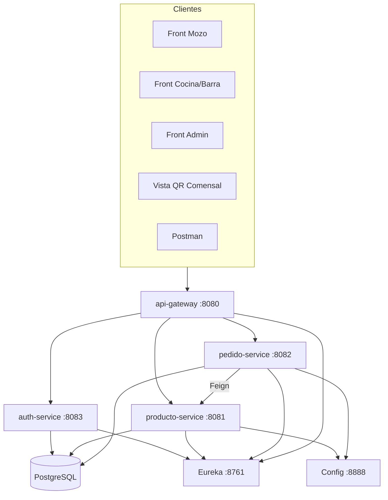

# Comandas de Restaurantes — Plan técnico y stack
## Documento complementario al plan de emprendimiento

**Relacionado con:** `Comandas-Restaurante-Emprendimiento.md`  
**Autor:** Luis Alberto Arias Ledesma  
**Curso:** Desarrollo de Servicios Web 2 — Cibertec  
**Versión:** 2.0 (completo)  
**Fecha:** 4 de junio de 2026

---

# 1. Propósito

Este documento define el **stack**, la **arquitectura**, el **modelo de datos**, las **APIs**, la **seguridad**, el **despliegue** y el **cronograma técnico** del proyecto *Comandas de Restaurantes*, alineado al demo **Spring Cloud** del curso y al plan de negocio aprobado.

---

# 2. Stack tecnológico

| Capa | Tecnología | Versión | Uso |
|------|------------|---------|-----|
| Lenguaje | OpenJDK | **17** | PC y VPS |
| Backend | Spring Boot | **3.5.14** | Parent de cada microservicio |
| Cloud | Spring Cloud | **2025.0.2** | Eureka, Config, Gateway, Feign |
| Build | Maven | 3.9+ | `mvn clean package` |
| Discovery | Netflix Eureka Server | vía Cloud BOM | `:8761` |
| Config | Spring Cloud Config (native) | `:8888` | YAML en `02-config-server` |
| Gateway | Spring Cloud Gateway (WebFlux) | `:8080` | Entrada única `/api/**` |
| Inter-servicios | OpenFeign + `lb://` | — | `pedido` → `producto` |
| BD | PostgreSQL | 15+ | Persistencia |
| ORM | Spring Data JPA + Hibernate | — | Entidades y repos |
| Migraciones | Flyway o `ddl-auto=validate` | — | Scripts SQL versionados |
| Seguridad | Spring Security + JWT | — | `06-auth-service` |
| Validación | Jakarta Validation | — | DTOs |
| Tiempo real | Spring WebSocket o SSE | — | Mesas y notificaciones mozo |
| Front MVP | HTML + CSS + JavaScript (o Vue/React) | — | Consumen Gateway |
| Front fase 3 | PWA | — | App comensal |
| Proxy prod | Nginx + Let's Encrypt | — | HTTPS → 8080 |
| Proceso VPS | systemd | — | Un servicio por JAR |
| Pagos fase 3 | API REST pasarela (mock dev) | — | Culqi / Niubiz (por definir) |

**Regla:** no cambiar versiones Boot/Cloud/Java sin validar con el profesor.

---

# 3. Estado actual vs objetivo

| Componente | Hoy (demo clase) | Objetivo MVP comandas |
|------------|------------------|------------------------|
| `producto-service` | Lista fija en memoria | CRUD menú en PostgreSQL por restaurante |
| `pedido-service` | `GET /pedidos/simular/{id}` | Mesas, comandas, líneas, estados, Feign a producto |
| `api-gateway` | `/api/productos`, `/api/pedidos` | + auth, mesas, comandas, público QR |
| `auth-service` | No existe | Login JWT, roles, alta usuarios |
| Frontend | No existe | Web mozo, cocina, admin, vista QR |
| BD | No existe | PostgreSQL multi-tenant |
| VPS | 5 JARs + systemd | + PostgreSQL + eventualmente 6.º JAR auth |

---

# 4. Arquitectura

## 4.1 Diagrama lógico (MVP objetivo)



## 4.2 Microservicios y puertos

| Orden arranque | Módulo | `spring.application.name` | Puerto | BD |
|----------------|--------|---------------------------|--------|-----|
| 1 | `01-eureka-server` | eureka-server | 8761 | — |
| 2 | `02-config-server` | config-server | 8888 | — |
| 3 | `03-producto-service` | producto-service | 8081 | Sí |
| 4 | `04-pedido-service` | pedido-service | 8082 | Sí |
| 5 | `06-auth-service` | auth-service | 8083 | Sí |
| 6 | `05-api-gateway` | api-gateway | 8080 | — |

## 4.3 Correspondencia negocio → servicio

| Función negocio | Servicio | Paquete base sugerido |
|-----------------|----------|----------------------|
| Login, usuarios, roles | auth-service | `com.cibertec.auth` |
| Menú, categorías, COCINA/BARRA | producto-service | `com.cibertec.producto` |
| Mesas, comandas, estados, planes | pedido-service | `com.cibertec.pedido` |
| Enrutamiento, CORS, rate limit futuro | api-gateway | `com.cibertec.gateway` |
| Mapa comensal, autoatención, pagos | comensal-service *(fase 3)* | `com.cibertec.comensal` |

---

# 5. Modelo de datos (PostgreSQL)

## 5.1 Diagrama entidad-relación (texto)

```
restaurante 1 ── * usuario
restaurante 1 ── * mesa
restaurante 1 ── * producto
restaurante 1 ── * categoria (opcional)
mesa 1 ── * sesion_mesa
sesion_mesa 1 ── * comanda
comanda 1 ── * linea_pedido
producto * ── 1 linea_pedido
```

## 5.2 Tablas y campos

### `restaurante`
| Campo | Tipo | Notas |
|-------|------|-------|
| id | BIGSERIAL PK | |
| nombre | VARCHAR(120) | Texto; visible en gratis |
| plan | VARCHAR(20) | `FREE`, `PREMIUM` |
| limite_mesas | INT | Default 15 si FREE |
| logo_url | VARCHAR(500) | NULL si FREE |
| color_primario | VARCHAR(7) | NULL si FREE (#RRGGBB) |
| color_secundario | VARCHAR(7) | Premium |
| visible_app_comensal | BOOLEAN | Default false hasta fase 3 |
| pagos_app_habilitados | BOOLEAN | Flujo B |
| autoatencion_habilitada | BOOLEAN | Flujo C |
| modo_servicio_default | CHAR(1) | `A` o `B` |
| activo | BOOLEAN | |
| creado_en | TIMESTAMP | |

### `usuario`
| Campo | Tipo | Notas |
|-------|------|-------|
| id | BIGSERIAL PK | |
| restaurante_id | FK | Multi-tenant |
| username | VARCHAR(50) UNIQUE por restaurante | |
| password_hash | VARCHAR(255) | BCrypt |
| rol | VARCHAR(20) | `ADMIN`, `MOZO`, `COCINERO`, `BARRA` |
| activo | BOOLEAN | |

### `mesa`
| Campo | Tipo | Notas |
|-------|------|-------|
| id | BIGSERIAL PK | |
| restaurante_id | FK | |
| numero | INT | Único por restaurante |
| capacidad_sillas | INT | Default 4, max 8 |
| estado | VARCHAR(20) | `LIBRE`, `OCUPADA`, `RESERVADA` |
| qr_token | VARCHAR(64) UNIQUE | Para URL pública seguimiento |

### `categoria`
| Campo | Tipo | Notas |
|-------|------|-------|
| id | BIGSERIAL PK | |
| restaurante_id | FK | |
| nombre | VARCHAR(80) | Entrada, Bebida, etc. |

### `producto`
| Campo | Tipo | Notas |
|-------|------|-------|
| id | BIGSERIAL PK | |
| restaurante_id | FK | |
| categoria_id | FK nullable | |
| nombre | VARCHAR(120) | |
| precio | DECIMAL(10,2) | |
| estacion | VARCHAR(10) | `COCINA`, `BARRA` |
| activo | BOOLEAN | |

### `sesion_mesa`
| Campo | Tipo | Notas |
|-------|------|-------|
| id | BIGSERIAL PK | |
| mesa_id | FK | |
| abierta_en | TIMESTAMP | |
| cerrada_en | TIMESTAMP nullable | |
| abierta_por_usuario_id | FK | Mozo o sistema |

### `comanda`
| Campo | Tipo | Notas |
|-------|------|-------|
| id | BIGSERIAL PK | |
| sesion_mesa_id | FK | |
| numero_turno | INT | 1, 2, 3… por sesión |
| origen | VARCHAR(25) | `MOZO`, `APP_ANTICIPADO`, `APP_AUTOATENCION` |
| estado | VARCHAR(25) | Ver §5.3 |
| modo_servicio | CHAR(1) | `A` o `B` (hereda default restaurante) |
| enviada_en | TIMESTAMP nullable | |
| lista_para_servir_en | TIMESTAMP nullable | Modo A |

### `linea_pedido`
| Campo | Tipo | Notas |
|-------|------|-------|
| id | BIGSERIAL PK | |
| comanda_id | FK | |
| producto_id | FK | Snapshot precio opcional |
| numero_silla | INT | |
| cantidad | INT | |
| notas | VARCHAR(255) | |
| precio_unitario | DECIMAL(10,2) | Congelado al enviar |
| estado | VARCHAR(25) | Ver §5.3 |
| pagado | BOOLEAN | Obligatorio true en autoatención |
| producto_nombre_snapshot | VARCHAR(120) | Si producto se borra después |

## 5.3 Estados (enum en código)

### Comanda
`BORRADOR` → `ENVIADA` → `EN_PREPARACION` → `PARCIALMENTE_LISTA` → `LISTA` → `ENTREGADA`  
Cancelación: `ANULADA` (solo antes de preparación, regla negocio).

### Línea pedido
`BORRADOR` → `ENVIADA` → `EN_PREPARACION` → `LISTA` → `ENTREGADA` | `ANULADA`

### Mesa
`LIBRE` ↔ `OCUPADA` (al abrir/cerrar sesión o autoatención pagada).

## 5.4 Reglas en BD / servicio

- Antes de insertar `mesa`: `COUNT(*) WHERE restaurante_id = ?` ≤ `limite_mesas` (15 si FREE).
- Índices: `(restaurante_id)`, `(mesa_id, estado)`, `(comanda_id, estado)`.
- Todas las consultas filtran por `restaurante_id` del JWT (excepto API pública QR con token).

---

# 6. API REST completa (Gateway `http://host:8080`)

Convenciones:
- Prefijo público: `/api`
- JSON; UTF-8
- Auth: header `Authorization: Bearer {jwt}` salvo rutas `/api/publico/**`
- Errores: `{ "error": "codigo", "mensaje": "..." }`

## 6.1 Auth-service (`/api/auth/**` → StripPrefix → auth-service)

| Método | Ruta Gateway | Body / params | Respuesta | Rol |
|--------|--------------|---------------|-----------|-----|
| POST | `/api/auth/login` | `{ username, password }` | `{ token, rol, restauranteId, nombreRestaurante }` | Público |
| POST | `/api/auth/usuarios` | `{ username, password, rol }` | `{ id, username, rol }` | ADMIN |
| GET | `/api/auth/usuarios` | — | Lista usuarios activos | ADMIN |
| PATCH | `/api/auth/usuarios/{id}/desactivar` | — | 204 | ADMIN |

## 6.2 Producto-service (`/api/productos/**`)

| Método | Ruta | Descripción | Rol |
|--------|------|-------------|-----|
| GET | `/api/productos` | Lista menú (`?categoriaId`, `?estacion`) | MOZO, ADMIN, COCINERO |
| GET | `/api/productos/{id}` | Detalle | MOZO, ADMIN |
| POST | `/api/productos` | Crear producto | ADMIN |
| PUT | `/api/productos/{id}` | Actualizar | ADMIN |
| DELETE | `/api/productos/{id}` | Baja lógica `activo=false` | ADMIN |
| GET | `/api/productos/categorias` | Categorías del restaurante | Todos operativos |

*Mantiene compatibilidad demo:* datos ya no solo en memoria.

## 6.3 Pedido-service (`/api/pedidos/**` ampliado — rutas nuevas bajo mismo servicio o prefijo `/api/mesas`)

Se recomienda en Gateway rutas dedicadas que reenvíen a `pedido-service`:

| Método | Ruta Gateway | Descripción | Rol |
|--------|--------------|-------------|-----|
| GET | `/api/mesas` | Todas las mesas con estado | MOZO, ADMIN |
| POST | `/api/mesas` | Crear mesa (valida límite 15 FREE) | ADMIN |
| POST | `/api/mesas/{mesaId}/abrir` | Abre `sesion_mesa`, estado OCUPADA | MOZO |
| POST | `/api/mesas/{mesaId}/cerrar` | Cierra sesión, LIBRE | MOZO, ADMIN |
| GET | `/api/mesas/{mesaId}/sesion-activa` | Sesión y comandas abiertas | MOZO |
| POST | `/api/mesas/{mesaId}/sillas/{silla}/lineas` | Agrega línea BORRADOR | MOZO |
| DELETE | `/api/lineas/{lineaId}` | Anula si BORRADOR | MOZO |
| POST | `/api/comandas/{comandaId}/enviar` | BORRADOR → ENVIADA, a cocina | MOZO |
| GET | `/api/comandas/pendientes` | Cola cocina (`?estacion=COCINA`) | COCINERO, BARRA |
| PATCH | `/api/lineas/{lineaId}/estado` | `{ estado: EN_PREPARACION \| LISTA }` | COCINERO, BARRA |
| GET | `/api/mozo/notificaciones` | Pendientes “listo para servir” | MOZO |
| PATCH | `/api/comandas/{id}/entregada` | Marca ENTREGADA | MOZO |
| GET | `/api/pedidos/simular/{productoId}` | *(legacy demo)* | Público prueba |

### Ejemplo flujo mozo (secuencia)
1. `POST /api/auth/login`
2. `GET /api/mesas` → elige mesa 5
3. `POST /api/mesas/5/abrir`
4. `POST /api/mesas/5/sillas/2/lineas` `{ productoId, cantidad, notas }`
5. `POST /api/comandas/{id}/enviar`
6. Cocina: `PATCH /api/lineas/{id}/estado` → `LISTA`
7. Mozo: `GET /api/mozo/notificaciones` (modo A: cuando todas las líneas LISTA)

## 6.4 Público — QR comensal (sin JWT)

| Método | Ruta | Descripción |
|--------|------|-------------|
| GET | `/api/publico/pedido/{qrToken}` | `{ mesa, silla, lineas: [{ nombre, estado }], comandaEstado }` |

Sin precios por defecto (regla negocio). Rate limit en Gateway.

## 6.5 Fase 3 — Comensal (`comensal-service` o módulo en pedido)

| Método | Ruta | Descripción |
|--------|------|-------------|
| GET | `/api/comensal/restaurantes` | `?lat=&lng=` mapa + precios ref. |
| GET | `/api/comensal/restaurantes/{id}/mesas/disponibilidad` | LIBRE/OCUPADA tiempo real |
| POST | `/api/comensal/pedidos/anticipado` | Flujo B + pago opcional |
| POST | `/api/comensal/pedidos/autoatencion` | Flujo C + pago obligatorio |
| POST | `/api/pagos/webhook` | Confirmación pasarela |

## 6.6 WebSocket / SSE (MVP+)

| Canal | Suscriptores | Evento |
|-------|--------------|--------|
| `/ws/restaurante/{id}/mesas` | App comensal, admin | `MESA_ESTADO_CAMBIADO` |
| `/ws/mozo/{usuarioId}` | Front mozo | `COMANDA_LISTA_SERVIR` |
| `/ws/cocina/{restauranteId}` | Front cocina | `NUEVA_COMANDA` |

Implementación sugerida: WebSocket en `pedido-service` (alineado a práctica DSW).

---

# 7. Spring Cloud Gateway — rutas a configurar

Archivo: `05-api-gateway/src/main/resources/application.yml`

| id | Path | uri | StripPrefix |
|----|------|-----|-------------|
| producto-service | `/api/productos/**` | `lb://producto-service` | 1 |
| pedido-service | `/api/pedidos/**` | `lb://pedido-service` | 1 |
| pedido-mesas | `/api/mesas/**` | `lb://pedido-service` | 1 |
| pedido-comandas | `/api/comandas/**` | `lb://pedido-service` | 1 |
| pedido-lineas | `/api/lineas/**` | `lb://pedido-service` | 1 |
| pedido-mozo | `/api/mozo/**` | `lb://pedido-service` | 1 |
| auth-service | `/api/auth/**` | `lb://auth-service` | 1 |
| publico | `/api/publico/**` | `lb://pedido-service` | 1 |
| comensal *(fase 3)* | `/api/comensal/**` | `lb://comensal-service` | 1 |

En VPS, `eureka.client.service-url.defaultZone` debe apuntar a `http://127.0.0.1:8761/eureka/`.

---

# 8. Config Server — propiedades centralizadas

Archivos en `02-config-server/src/main/resources/configs/`:

### `producto-service.yml` (ampliar)
```yaml
spring:
  datasource:
    url: jdbc:postgresql://${DB_HOST:localhost}:5432/comandas
    username: ${DB_USER:comandas}
    password: ${DB_PASS:comandas}
  jpa:
    hibernate:
      ddl-auto: validate
producto:
  descuento: 0
```

### `pedido-service.yml` (ampliar)
```yaml
pedido:
  igv: 18
  plan:
    mesas-max-free: 15
  modo-servicio-default: A
```

### `auth-service.yml` (nuevo)
```yaml
auth:
  jwt:
    secret: ${JWT_SECRET:cambiar-en-produccion}
    expiration-minutes: 480
```

---

# 9. Seguridad (JWT)

## 9.1 Flujo login
1. Cliente `POST /api/auth/login`.
2. `auth-service` valida BCrypt, genera JWT con claims: `sub`, `rol`, `restauranteId`.
3. Cliente envía `Authorization: Bearer` en siguientes llamadas.
4. Cada microservicio (o Gateway filter) valida firma y extrae `restauranteId`.

## 9.2 Matriz de roles

| Recurso | ADMIN | MOZO | COCINERO | BARRA |
|---------|-------|------|----------|-------|
| CRUD mesas/menú/usuarios | Sí | No | No | No |
| Tomar pedido / enviar comanda | Sí | Sí | No | No |
| Cola cocina COCINA | No | No | Sí | No |
| Cola barra BARRA | No | No | No | Sí |
| Ver notificaciones mozo | Sí | Sí | No | No |

## 9.3 Dependencias Maven (`06-auth-service`)
- `spring-boot-starter-web`
- `spring-boot-starter-security`
- `spring-boot-starter-data-jpa`
- `postgresql`
- `jjwt` o `spring-security-oauth2-resource-server`
- `spring-cloud-starter-netflix-eureka-client`
- `spring-cloud-starter-config`

---

# 10. Dependencias a agregar en servicios existentes

### `03-producto-service`
- `spring-boot-starter-data-jpa`
- `postgresql`
- `flyway-core` (opcional)

### `04-pedido-service`
- `spring-boot-starter-data-jpa`
- `postgresql`
- `spring-boot-starter-websocket` (MVP+)
- Mantiene: Feign, Eureka, Config

---

# 11. Frontend (MVP)

| App | URL sugerida | Tecnología | APIs principales |
|-----|--------------|------------|------------------|
| Login | `/login.html` | HTML/JS | `POST /api/auth/login` |
| Admin | `/admin/` | HTML/JS o Vue | mesas, productos, usuarios |
| Mozo | `/mozo/` | Mobile-first CSS | mesas, lineas, comandas |
| Cocina | `/cocina/` | Tablet layout | pendientes, PATCH estado |
| QR | `/publico/pedido.html?token=` | Polling 5s o SSE | `GET /api/publico/pedido/{token}` |

Front puede servirse desde Nginx estático en el VPS o desde un futuro `09-web-static`.

---

# 12. Infraestructura y despliegue

## 12.1 VPS (ya operativo)

| Servicio systemd | JAR | Puerto |
|------------------|-----|--------|
| eureka | eureka-server-1.0.0.jar | 8761 |
| config-server | config-server-1.0.0.jar | 8888 |
| producto | producto-service-1.0.0.jar | 8081 |
| pedido | pedido-service-1.0.0.jar | 8082 |
| gateway | api-gateway-1.0.0.jar | 8080 |
| auth *(nuevo)* | auth-service-1.0.0.jar | 8083 |

## 12.2 PostgreSQL en VPS

```bash
sudo apt install postgresql
sudo -u postgres createuser comandas -P
sudo -u postgres createdb comandas -O comandas
```

Conexión solo `localhost`; credenciales en variables de entorno del systemd unit.

## 12.3 Nginx (recomendado producción)

```nginx
server {
    listen 443 ssl;
    server_name api.tudominio.com;
    location / {
        proxy_pass http://127.0.0.1:8080;
    }
}
```

## 12.4 Entornos

| Entorno | Eureka | BD | Front |
|---------|--------|-----|-------|
| Local dev | localhost:8761 | PostgreSQL Docker o local | localhost:5500 |
| VPS prueba | IP:8761 | PostgreSQL mismo VPS | IP:8080 o Nginx |

---

# 13. Plan de implementación por fases (cronograma sugerido)

## Fase 0 — Preparación (1 semana)
- [ ] Crear BD y scripts Flyway V1
- [ ] Crear `06-auth-service` desde Spring Initializr (mismas versiones)
- [ ] Datos semilla: 1 restaurante FREE, 10 mesas, admin, mozo, cocinero, 10 productos

## Fase MVP — Core (3–4 semanas)
- [ ] JPA en producto-service (CRUD)
- [ ] JPA en pedido-service (mesas, sesiones, comandas, líneas)
- [ ] Lógica modos A/B y notificaciones mozo (polling mínimo si no WebSocket)
- [ ] Integración Feign: pedido valida producto al agregar línea
- [ ] Gateway rutas nuevas
- [ ] API pública QR
- [ ] Front mozo + cocina + login
- [ ] Pruebas Postman collection
- [ ] Despliegue VPS + migración BD

## Fase 2 — Premium (2 semanas)
- [ ] Campos branding; validación mesa 16+
- [ ] Flag plan PREMIUM manual o pasarela suscripción mock
- [ ] Reportes SQL básicos

## Fase 3 — Comensal (4+ semanas)
- [ ] `08-comensal-service` o extensión pedido
- [ ] WebSocket mesas
- [ ] Pagos mock + autoatención
- [ ] PWA comensal

---

# 14. Pruebas

| Tipo | Herramienta | Qué validar |
|------|-------------|-------------|
| API | Postman / curl | Flujo mozo completo, límite 15 mesas |
| Integración | Eureka dashboard | 4–6 servicios UP |
| Regresión demo | `GET /api/pedidos/simular/1` | Sigue funcionando o documentar reemplazo |
| Carga ligera | 10 comandas concurrentes | Sin duplicar mesa en autoatención (fase 3) |
| Seguridad | Token expirado / rol incorrecto | 401/403 |

---

# 15. Reglas técnicas ↔ negocio (matriz completa)

| ID negocio | Implementación técnica |
|------------|----------------------|
| RN-06 FREE ≤15 mesas | `PedidoService.crearMesa()` + `plan` en JWT |
| RN-07 Modo A/B | `Comanda.modoServicio`; `NotificacionService` |
| RN-08 Móvil sin TV | Front responsive; QR web |
| RN-11 Pagos opcionales anticipado | Flag `pagos_app_habilitados` + endpoint pago |
| RN-13 Pago obligatorio autoatención | Validar `pagado=true` en `enviar` |
| RN-14 Mesas tiempo real | WebSocket + `mesa.estado` transaccional |
| Premium branding | Columnas `logo_url`, colores; CSS variables en front |

---

# 16. Entregables curso DSW

| # | Entregable | Archivo / evidencia |
|---|------------|---------------------|
| 1 | Plan de negocio | `Comandas-Restaurante-Emprendimiento.md` |
| 2 | Plan técnico | **Este documento** |
| 3 | Código microservicios | Repo `spring-cloud-demo` |
| 4 | Demo en VPS | URL Gateway + captura Eureka |
| 5 | Colección Postman | `docs/postman/` *(opcional)* |
| 6 | Video o informe de prueba | Flujo mozo → cocina → listo |

---

# 17. Riesgos y mitigación

| Riesgo | Prob. | Impacto | Mitigación |
|--------|-------|---------|------------|
| Scope creep fase 3 | Alta | Alto | MVP cerrado; fase 3 documentada solo |
| JWT mal compartido entre servicios | Media | Alto | Librería común `com.cibertec.common` o validación en Gateway |
| PostgreSQL no en VPS | Media | Alto | Instalar antes de codificar JPA |
| Doble selección mesa autoatención | Media | Medio | `SELECT FOR UPDATE` al pagar |
| Profesor exige solo demo original | Baja | Medio | Mantener endpoint simular + nuevas rutas |

---

# 18. Resumen ejecutivo

**Comandas de Restaurantes** se construye sobre el **demo Spring Cloud Cibertec** (Java 17, Boot 3.5.14, Eureka, Config, Gateway, Feign), ampliando **producto-service** y **pedido-service** con **PostgreSQL**, añadiendo **auth-service** (JWT) y fronts web ligeros. El **MVP** cubre mozo–cocina–QR sin app marketplace; las **fases 2 y 3** agregan premium, app comensal tipo Uber, mesas en vivo y pagos opcionales u obligatorios según configuración del dueño. Despliegue en **VPS con systemd** ya probado; se añade PostgreSQL y rutas Gateway documentadas en este plan.

---

# Historial

| Versión | Fecha | Cambio |
|---------|-------|--------|
| 1.0 | 04/06/2026 | Borrador inicial |
| 2.0 | 04/06/2026 | Documento completo: BD, APIs, Gateway, JWT, cronograma, despliegue |
