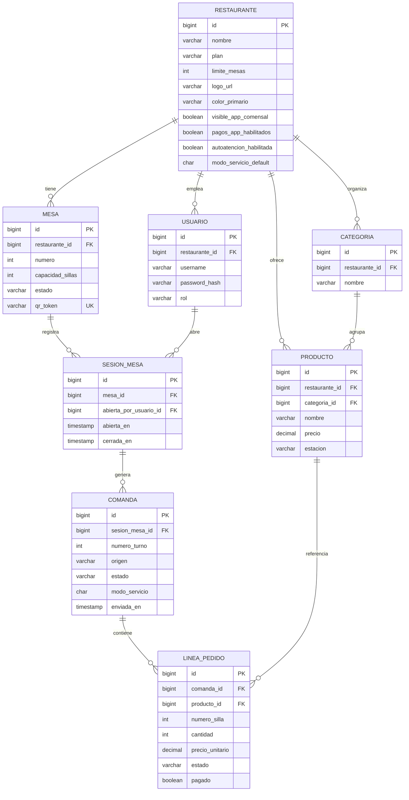

# Comandas de Restaurantes — Modelo Entidad-Relación (DER)
## DOC-04 | Diseño de datos

**Referencia:** DOC-02 §5  
**Autor:** Luis Alberto Arias Ledesma  
**SGBD:** PostgreSQL 15+  
**Versión:** 1.0

---

# 1. Diagrama entidad-relación



---

# 2. Diccionario de datos

## 2.1 RESTAURANTE
| Campo | Tipo | Nulo | Descripción |
|-------|------|:----:|-------------|
| id | BIGSERIAL | NO | Identificador |
| nombre | VARCHAR(120) | NO | Nombre comercial |
| plan | VARCHAR(20) | NO | FREE, PREMIUM |
| limite_mesas | INTEGER | NO | 15 si FREE |
| logo_url | VARCHAR(500) | SÍ | Premium |
| color_primario | VARCHAR(7) | SÍ | Premium #RRGGBB |
| color_secundario | VARCHAR(7) | SÍ | Premium |
| visible_app_comensal | BOOLEAN | NO | Default false |
| pagos_app_habilitados | BOOLEAN | NO | Default false |
| autoatencion_habilitada | BOOLEAN | NO | Default false |
| modo_servicio_default | CHAR(1) | NO | A o B |
| activo | BOOLEAN | NO | |
| creado_en | TIMESTAMPTZ | NO | |

## 2.2 USUARIO
| Campo | Tipo | Nulo | Descripción |
|-------|------|:----:|-------------|
| id | BIGSERIAL | NO | |
| restaurante_id | BIGINT | NO | FK RESTAURANTE |
| username | VARCHAR(50) | NO | Único por restaurante |
| password_hash | VARCHAR(255) | NO | BCrypt |
| rol | VARCHAR(20) | NO | ADMIN, MOZO, COCINERO, BARRA |
| activo | BOOLEAN | NO | |

## 2.3 MESA
| Campo | Tipo | Nulo | Descripción |
|-------|------|:----:|-------------|
| id | BIGSERIAL | NO | |
| restaurante_id | BIGINT | NO | FK |
| numero | INTEGER | NO | UK (restaurante_id, numero) |
| capacidad_sillas | INTEGER | NO | 1–8 |
| estado | VARCHAR(20) | NO | LIBRE, OCUPADA, RESERVADA |
| qr_token | VARCHAR(64) | NO | UK, URL pública |

## 2.4 PRODUCTO / CATEGORIA / SESION_MESA / COMANDA / LINEA_PEDIDO
Ver definición completa en DOC-02 §5.2.

---

# 3. Restricciones e integridad

| Código | Restricción |
|--------|-------------|
| CK-01 | `restaurante.plan IN ('FREE','PREMIUM')` |
| CK-02 | `mesa.estado IN ('LIBRE','OCUPADA','RESERVADA')` |
| CK-03 | `producto.estacion IN ('COCINA','BARRA')` |
| CK-04 | `comanda.modo_servicio IN ('A','B')` |
| CK-05 | `COUNT(mesa) WHERE restaurante_id = X` ≤ `restaurante.limite_mesas` |
| UK-01 | `(restaurante_id, numero)` en MESA |
| UK-02 | `(restaurante_id, username)` en USUARIO |

---

# 4. Índices recomendados

```sql
CREATE INDEX idx_mesa_restaurante ON mesa(restaurante_id);
CREATE INDEX idx_mesa_estado ON mesa(restaurante_id, estado);
CREATE INDEX idx_comanda_sesion ON comanda(sesion_mesa_id);
CREATE INDEX idx_linea_comanda ON linea_pedido(comanda_id);
CREATE INDEX idx_linea_estado ON linea_pedido(estado);
CREATE INDEX idx_producto_restaurante ON producto(restaurante_id);
```

---

# 5. Script DDL inicial (referencia Flyway V1)

```sql
-- V1__schema_comandas.sql (extracto)
CREATE TABLE restaurante (
    id BIGSERIAL PRIMARY KEY,
    nombre VARCHAR(120) NOT NULL,
    plan VARCHAR(20) NOT NULL DEFAULT 'FREE',
    limite_mesas INT NOT NULL DEFAULT 15,
    modo_servicio_default CHAR(1) NOT NULL DEFAULT 'A',
    pagos_app_habilitados BOOLEAN NOT NULL DEFAULT FALSE,
    autoatencion_habilitada BOOLEAN NOT NULL DEFAULT FALSE,
    activo BOOLEAN NOT NULL DEFAULT TRUE,
    creado_en TIMESTAMPTZ NOT NULL DEFAULT NOW()
);
-- ... resto de tablas según DOC-02
```

---

# 6. Política multi-tenant

Toda consulta de negocio incluye `WHERE restaurante_id = :tenantId` obtenido del JWT, excepto:
- Login (resuelve tenant por username)
- API pública QR (resuelve por `qr_token` → mesa → restaurante)

---

*Fin DOC-04*
