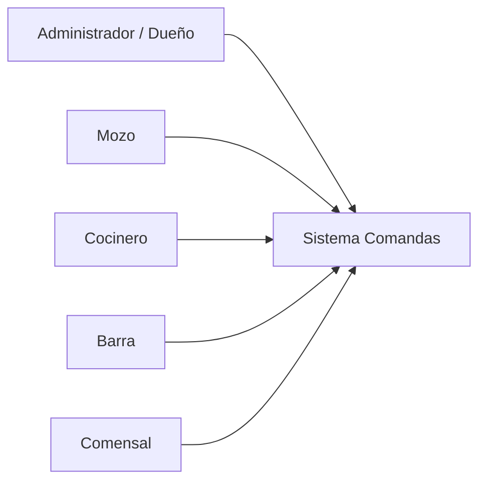
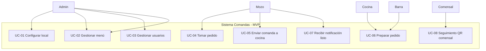
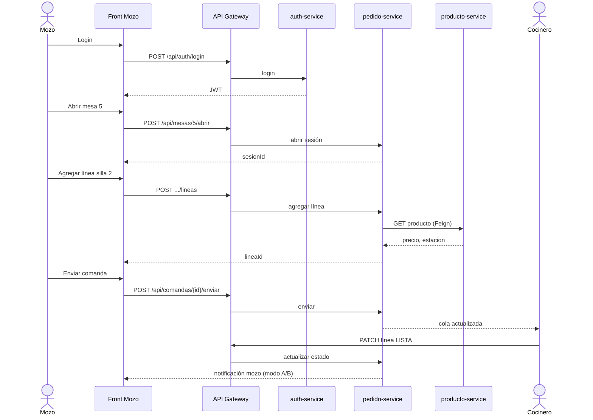
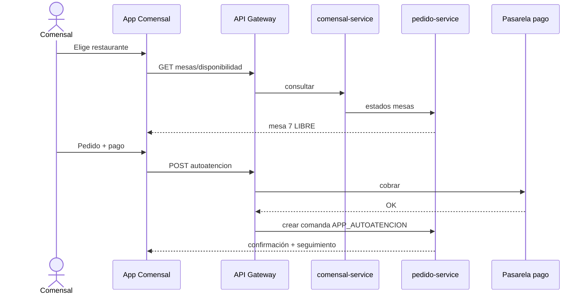
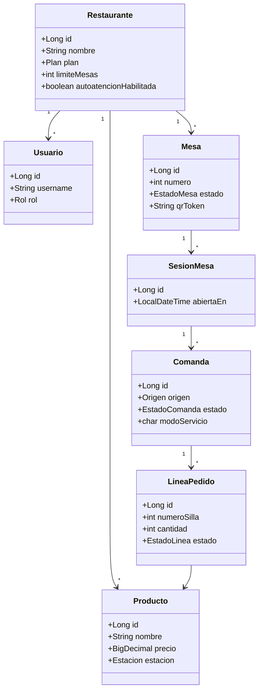
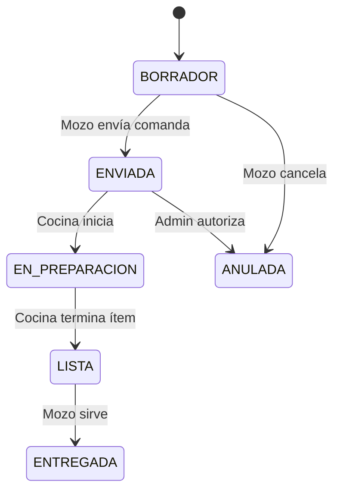
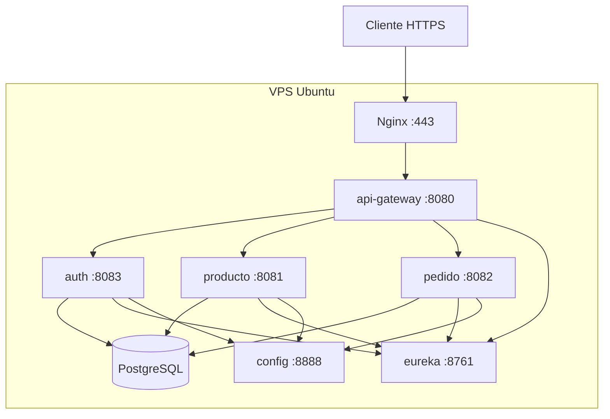

# Comandas de Restaurantes — Modelado UML
## DOC-03 | Análisis y diseño

**Referencia:** DOC-01 Emprendimiento, DOC-02 Plan técnico  
**Autor:** Luis Alberto Arias Ledesma  
**Versión:** 1.0

---

# 1. Actores del sistema (diagrama de contexto)

| Actor | Descripción breve |
|-------|-------------------|
| Administrador | Configura restaurante, usuarios, menú, mesas, planes |
| Mozo | Opera mesas, comandas, recibe notificaciones |
| Cocinero | Cola estación COCINA |
| Barra | Cola estación BARRA |
| Comensal | QR en mesa (MVP); app marketplace (fase 3) |

---

# 2. Diagrama de casos de uso (MVP)

## 2.1 Matriz actor — caso de uso

| Caso de uso | Admin | Mozo | Cocina | Barra | Comensal |
|-------------|:-----:|:----:|:------:|:-----:|:--------:|
| UC-01 Configurar local | X | | | | |
| UC-02 Gestionar menú | X | | | | |
| UC-03 Gestionar usuarios | X | | | | |
| UC-04 Tomar pedido | | X | | | |
| UC-05 Enviar comanda | | X | | | |
| UC-06 Preparar pedido | | | X | X | |
| UC-07 Notificación listo | | X | | | |
| UC-08 Seguimiento QR | | | | | X |

---

# 3. Caso de uso detallado — UC-05 Enviar comanda a cocina

| Campo | Descripción |
|-------|-------------|
| **ID** | UC-05 |
| **Actor principal** | Mozo |
| **Precondiciones** | Mozo autenticado; mesa con sesión abierta; al menos una línea en BORRADOR |
| **Postcondiciones** | Comanda en estado ENVIADA; líneas visibles en cocina/barra |
| **Flujo principal** | 1. Mozo selecciona mesa y silla → 2. Agrega ítems → 3. Confirma envío → 4. Sistema valida y notifica cocina |
| **Flujo alternativo A** | Sin conexión: mensaje de error; reintento |
| **Flujo alternativo B** | Modo A: cocina marca ítems; al completar comanda, notifica mozo |
| **Reglas de negocio** | RN-01, RN-02, RN-07 |

---

# 4. Diagrama de secuencia — Tomar pedido y enviar a cocina (MVP)

---

# 5. Diagrama de secuencia — Autoatención al llegar (fase 3)

---

# 6. Diagrama de clases (dominio simplificado)

---

# 7. Diagrama de estados — Línea de pedido

---

# 8. Diagrama de despliegue (VPS)

---

# 9. Trazabilidad requisitos — casos de uso

| RF (DOC-02) | Caso de uso |
|-------------|-------------|
| RF-01, RF-01b | UC-01 |
| RF-02 | UC-03 |
| Producto CRUD | UC-02 |
| RF-03, RF-04 | UC-04, UC-05 |
| RF-05, RF-06 | UC-06 |
| RF-07 | UC-07 |
| RF-08 | UC-08 |

---

*Fin DOC-03 — Exportar diagramas mermaid a imagen si el informe Word no admite mermaid nativo.*
